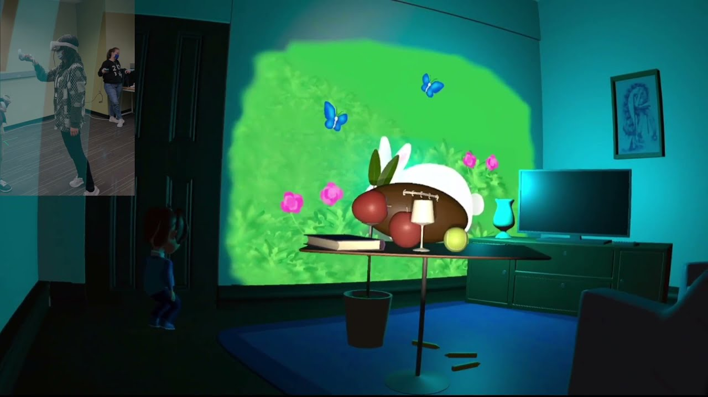
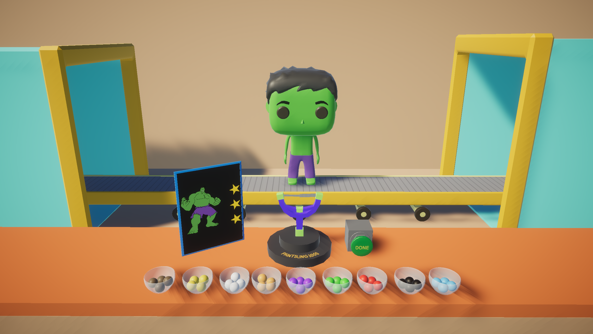
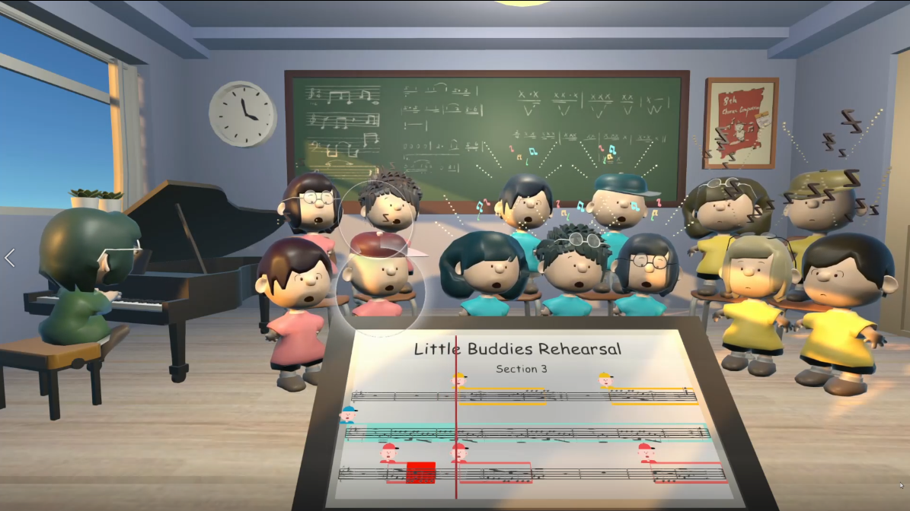
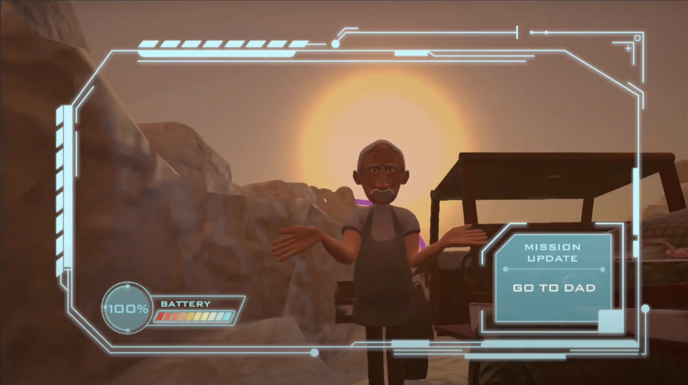

# Building Virtual Worlds

This repo is only intended to archive and showcase the codes I wrote in [Building Virtual Worlds](https://www.etc.cmu.edu/learn/curriculum/building-virtual-worlds/), a course at [CMU ETC](https://www.etc.cmu.edu/), Fall 2021.

This repo doesn't contain the full projects and are not supposed to be runnable independently because I only excerpted the script files that I did mostly. Nonetheless, the codes in Round 5 were more intertwined since we modified each other's code interchangeably, so I'd like to credit my partner [Tanvi Ganu](https://www.linkedin.com/in/tanviganu/).

Final playthrough videos and more info about each project are available below:

- Round 1:  [Light Up](https://youtu.be/22935jY5L7M)

  

- Round 2: [Funki Pop Factory](https://youtu.be/w8bBbeH08bI)

  

- Round 3: [Little Choir Buddies](https://youtu.be/txK7lQ7tlrY)

  

- Round 4: [Oasis](https://youtu.be/yYAB6qUZw0U)

  

- Round 5: [Monsters vs. Robots](https://youtu.be/KAisLbMMjwM)

  
